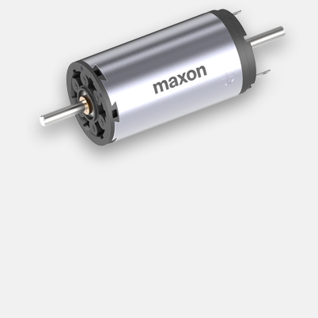
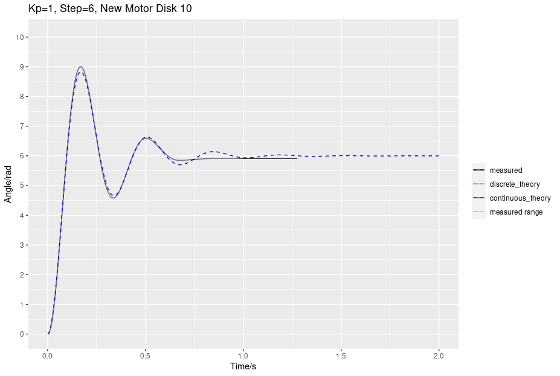

# spinner-amax
Spinner experiment with Maxxon AMAX 32 motor

## Status

In development. The AMAX 32 motor variant is part number: 236668

The technical specs are [here](./hw/docEN-21-176.pdf/)

We are currently testing a prototype of the hardware and will be able to provide more updates soon.

Meanwhile, here is a measured step response (average of seven runs)

## Background

This is an updated version of the experiment we used in academic year 2021/22, which can be found [here](https://github.com/practable/spinner-nidec). The AMAX 32 motor we are using has less friction, so it has a more ideal second order response. We are currently developing this (See the develop branch if you want to know how far along we are).
